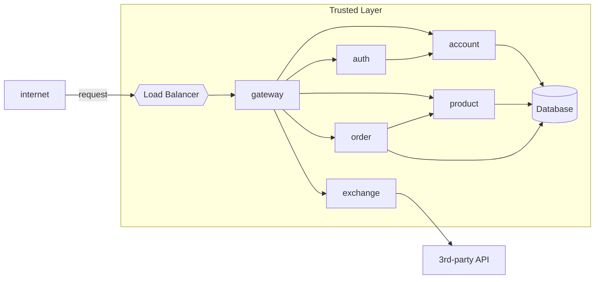

# Home

Aplicação web que permite aos usuários comprar e vender produtos

## Estrutura do projeto

O projeto é uma aplicação web que permite aos usuários comprar e vender produtos. Portanto existem três micro-serviços:

- [Product API](services/product): responsável por gerenciar os produtos disponíveis para compra, incluindo informações como nome, descrição, preço e estoque.
- [Order API](services/order): responsável por gerenciar os pedidos dos clientes, incluindo informações como produtos comprados, quantidade, preço total e status do pedido.
- [Exchange API](services/exchange): responsável por gerenciar as taxas de câmbio entre diferentes moedas, permitindo que os usuários realizem transações em diferentes moedas.

